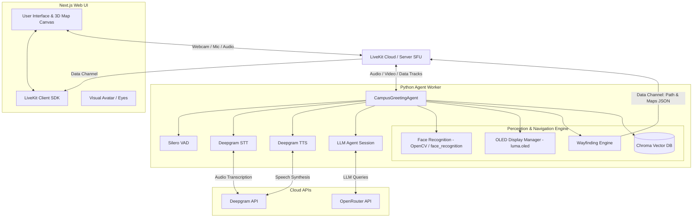

# Voice Agent System Architecture

This document provides a technical overview of how the Voice Agent works, its component design, and the third-party services it leverages.

---

## 🏗️ System Architecture Overview

The system is split into three main parts:
1. **Frontend (Next.js & React)**: A web-based UI serving as the kiosk display.
2. **LiveKit Cloud/Server**: The real-time communications layer managing WebRTC media tracks and data channel communication.
3. **Backend (Python Agent Worker)**: The intelligence hub running the LiveKit Agent framework, vision processing (Face Recognition), wayfinding navigation, hardware control, and vector database querying (RAG).

### System Topology & Data Flow

---

## 🛠️ Third-Party Services & APIs Used

The project integrates several external APIs to provide state-of-the-art voice interaction and image intelligence:

| Service / Tool | Purpose in Project | API / Backend Provider |
| :--- | :--- | :--- |
| **LiveKit Cloud** | Real-time WebRTC audio/video streaming, data channels, and orchestration. | [LiveKit](https://livekit.io/) |
| **Deepgram** | Transcribing user input (Speech-to-Text) and synthesizing the agent's voice response (Text-to-Speech) in real-time. | [Deepgram](https://deepgram.com/) |
| **OpenRouter** | Serving LLM completions (resolves to general LLMs using `openrouter/auto`) and executing multimodal image analyses (extracting event data using `google/gemini-2.5-flash`). | [OpenRouter](https://openrouter.ai/) |
| **Silero VAD** | High-performance, local Voice Activity Detection to accurately check when a user is speaking. | Loaded locally via PyTorch |

---

## 🔄 Core Processes & Interactions

### 1. Audio Processing & Conversation Loop
* **Voice Activity Detection (VAD):** The agent runs [Silero VAD](https://github.com/snakers4/silero-vad) locally to listen to the user’s incoming audio track. 
* **Speech-to-Text (STT):** When the user finishes speaking, the audio buffer is transcribed by [Deepgram's Nova-2](https://deepgram.com/product/speech-to-text) model.
* **Large Language Model (LLM):** The transcribed text is sent to the LLM (routed via **OpenRouter**). The LLM decides if it needs to trigger any Python functions (Tools) or reply immediately.
* **Text-to-Speech (TTS):** The text response is streamed into audio bytes using **Deepgram's Aura-luna** voice and pushed back to the LiveKit Room's audio track.

### 2. Vision & Face Recognition (Local)
* The agent subscribes to the user’s webcam feed from the LiveKit room.
* The webcam stream is processed locally using `cv2` (OpenCV) and the `face_recognition` library (dlib-based wrapper).
* It checks the camera frames against pickled face encodings in `known_faces/encodings.pkl`.
* When a face is recognized, the system triggers a **Proactive Greeting Task**: it announces the user's name (e.g. *"Hello Alice!"*) without waiting for the user to initiate the call.

### 3. RAG - Event Indexing & Database Querying
* **Poster Scanning:** Under `backend/event_indexer.py`, the worker scans `assets/` directories (`events`, `competitions`, `posts`).
* **Visual Data Extraction:** For each poster found, it sends the image to `google/gemini-2.5-flash` via OpenRouter to parse it into structured event JSON (title, date, location, description).
* **Storage:** These details are embedded and saved into a local instance of **ChromaDB**.
* **QA Tool:** When the user asks about upcoming campus events, the agent uses the `ask_about_events` tool to perform a semantic search against ChromaDB and feed the results to the LLM.

### 4. Campus Navigation & Wayfinding
* When the user asks for directions, the agent invokes the custom `get_directions` tool (managed by `wayfinding.py`).
* It loads coordinates from a localized map layout, resolves the shortest path to the destination, and:
  1. Returns a descriptive text response (e.g. *"Go down the hallway and turn left."*) for the voice reply.
  2. Publishes a structured JSON message containing 3D node coordinates over the LiveKit data channel.
* The Next.js frontend catches this data channel packet and visualizes the route on a 3D animated canvas interface.

### 5. Hardware Interface (Raspberry Pi Only)
* **OLED/TFT Eyes Display:** Controlled by `display_manager.py` (via `luma.oled`/`luma.lcd`), which dynamically updates animated eyes (showing emotions like *happy*, *thinking*, *lonely*, *tired*, *glitched*). These are driven in real-time by the agent's current state and voice output amplitude.
* **Servo Tracking:** Servos are actuated via `test_servos.py` or GPIO configurations to physically rotate the kiosk's camera towards the detected face's coordinates.
