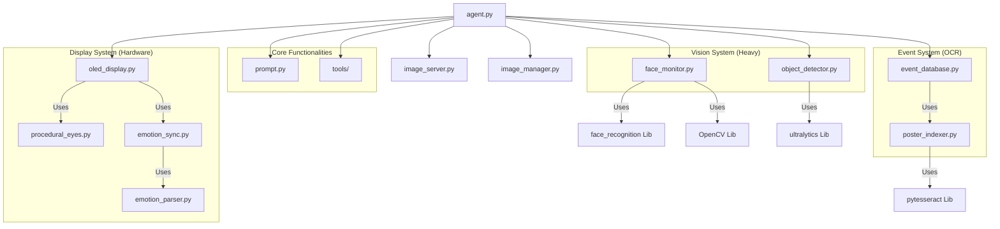

# System Dependency Graph

This document maps out how the different files in `backend/` are connected. Use this to understand what will break if you remove a file.

## 🛠️ Dependency Overview

## 💥 Impact Analysis: "What happens if I remove..."

### 1. The Vision System (`face_monitor.py`, `object_detector.py`)
*   **Dependencies**: `face_recognition`, `opencv-python`, `ultralytics`
*   **If Removed**:
    *   The agent will be **BLIND**.
    *   It cannot greet people automatically ("Hello John").
    *   It cannot answer "What do you see?" or "Find my keys".
    *   `agent.py` will need significant edits to remove the initialization code for these classes.

### 2. The Event System (`event_database.py`, `poster_indexer.py`)
*   **Dependencies**: `pytesseract`, `tesseract-ocr` (System), `chromadb`
*   **If Removed**:
    *   The agent cannot read posters.
    *   Tools like `ask_about_events` and `show_event_poster` will fail.
    *   This is **SAFE TO REMOVE** if you don't need the campus event features.

### 3. The Display System (`oled_display.py`, `procedural_eyes.py`)
*   **Dependencies**: `luma.oled`, `luma.lcd`
*   **If Removed**:
    *   The robot will have no face/eyes.
    *   The agent will still speak and listen, but the screen will be blank.
    *   You will get errors if running on a Raspberry Pi with a screen attached.
    *   **SAFE TO REMOVE** if running in "headless" mode (just voice).

### 4. The Image Server (`image_server.py`, `image_manager.py`)
*   **Dependencies**: `http.server`
*   **If Removed**:
    *   The frontend (UI) will not be able to show images (posters, maps, or user photos).
    *   The backend will error out on startup unless you remove the `ImageServer` initialization in `agent.py`.

## 🧹 Cleanup Recommendations

If you want a **minimal** voice-only agent:
1.  **Keep**: `agent.py`, `prompt.py`, `tools/`
2.  **Remove**: Everything else in the "subgraphs" above.
3.  **Edit `agent.py`**: Remove the imports and `_init_heavy_async` code related to the removed modules.
